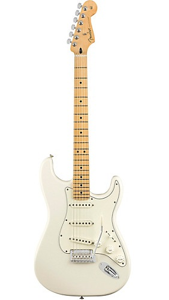
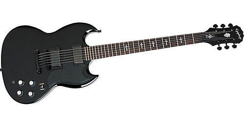
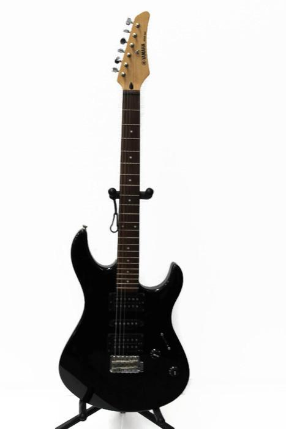
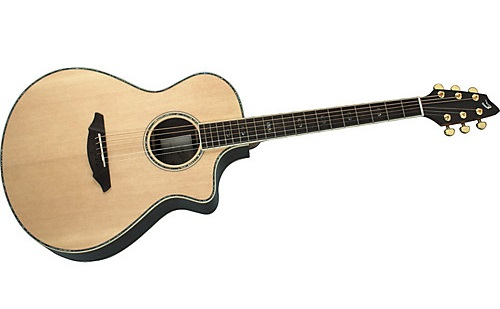
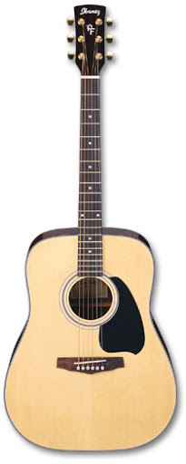

# Guitars

I'm having a hard time finding the specs on some of my older guitars.  This page will keep track of the specs so I know what types of equipment they have and how they differ from each other.

## Electrics

### Fender Stratocaster (Player Series)

Materials:

* Body: Alder
* Neck: Maple
* Fingerboard: Maple
* Pickups: SSS
  * Neck/Middle/Bridge: Player Series Stratocaster

Other Features:

* Body
  * Body shape: Double cutaway
  * Body type: Solid body
  * Body material: Solid wood
  * Body finish: Gloss
* Neck
  * Neck shape: C modern
  * Joint: Bolt-on
  * Scale length: 25.5 in.
  * Truss rod: Dual-action
  * Neck finish: Gloss
* Fingerboard
  * Radius: 9.5 in.
  * Fret size: Medium jumbo
  * Number of frets: 22
  * Inlays: Dot
  * Nut width/material 1.69 in. (43 mm) Synthetic Bone
* Controls
  * Pickup switch: 5-way
* Hardware
  * Bridge type: Tremolo/Vibrato
  * Bridge design: 2-point Fulcrum tremolo Bent steel saddles
  * Tuning machines: Die-cast sealed
  * Color: Chrome
* Country of origin: Mexico

Bought: 2/27/2021 (new) from GuitarCenter.com for $750. ($799 with taxes, free shipping).

Notes: I'd like to replace the pickguard with a sparkly pearl one and perhaps replace the bridge pickup with a Seymour Duncan SSL-5 (what David Gilmour used on his strat).

### Tony Iommi Signature G-400 Electric Guitar (Epiphone)

Materials:

* Body: mahogany
* Neck: mahogany
* Fretboard: Rosewood
* Pickups: Gibson USA Tony Iommi humbuckers

Features

* Ebony finish
* Set, mahogany slim-tapered neck
* 24-fret rosewood fingerboard with cross inlays
* 24.75" scale
* 1.6875" nut width
* Locktone Tune-O-Matic bridge and stopbar tailpiece
* Black chrome hardware
* Made in Korea

Bought: as a present for graduating college.  This was bought new, but it is a "2nd", indicating there is some minor flaw or defect with it.  This cut the price in half.

### Yamaha RGS 121

Materials:

* Body: Basswood
* Neck: Plain Sawn Maple
* Fretboard: Rosewood

Features:
* Radius: 12"
* Frets: 22 medium nickel
* Nut: 1.65
* Pickups HSH configuration original set
* Made in Japan

Bought: new, not too long after I left high school (2002?).  Think it was about $100-150.

## Accoustics

### Breedlove Atlas Series AC25/SR Plus

Materials:

* Top: Solid Sitka Spruce
* Back: Solid Rosewood
* Fretboard: Rosewood
* Bridge: Rosewood

Other Features (from: https://www.musiciansfriend.com/guitars/breedlove-atlas-series-ac25-sr-plus-acoustic-electric-guitar):

* Concert body style with soft cutaway
* Fishman Classic IV pickup
* Breedlove bracing system
* JLD Bridge Truss system
* Ivoroid bound body and neck
* Abalone rosette with purfling ring
* Abalone top purfling with BWBWB border
* Abalone Breedlove Diamonds fingerboard inlay pattern
* Glossy finish
* Hand-rubbed neck
* Dovetail neck joint
* Dual action truss rod
* Gold tuners
* Ebony end pin
* D'Addario EXP light-gauge strings
* Designed by Kim Breedlove, crafted in Korea
* Quality assured in Bend, Oregon, USA

Bought: 12/1/2018 (used) for $450 ($579 with shipping+taxes) on Reverb.com.

### Ibanez PF6

Ibanez PF6-NT-14-03

* PF = Performance Series
* NT = Natural Color

Materials

* Top: Spruce
* Back: Mahogany
* Neck: Mahogany
* Fretboard: Rosewood

Features:

* Ivorex II Nut and Saddle
* Advantage Bridge Pins
* Made in China

Bought: I think I bought this when I still lived in an apartment. (2004-2005?).  I think it was about $100-150.

## Wish List

* Bob Weir D'Angelico (Premier: $999, Deluxe: $1999)
